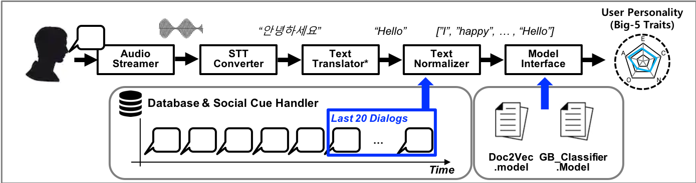

# 1. [M2-4] Personality Recognizer

## 2. Package summary

A personality recognizer is an agent that recognizes a user's personality in human-robot interaction. This agent can estimate Big-5 personality model defined in psychology. This package uses  data such as acoustical information from human behavior.

- 2.1 Maintainer status:  maintained
- 2.2 Maintainer: Hyeonuk Bhin <bhu@kist.re.kr>
- 2.3 Author: Hyeonuk Bhin, <bhu@kist.re.kr>
- 2.4 License (optional):
- 2.5 Source: git https://github.com/hyeonukbhin/deeptask_personality_recognizer (branch: master)

## 3. Overview
This package consists of five parts: 1) Audio Streamer, 2) STT Converter, 3) Text Translator, 4) Text Normalizer and 5) Model Interface. Audio Streamer converts human voice into PCM streaming data. STT Converter converts PCM data into speech sentence text dynamically. Text Translator is responsible for translating Korean sentences into English sentences. Text Normalizer retrieves last 20 sentences from database and then makes document token for word-embedding model. Finally, Model interface classifies user’s document token into each class of Big-5 Personality Traits using trained Deep Learning model and classifier. Following figure shows the overall structure of the personality recognizer.

<center></a></center>


## 4. Hardware requirements
There are our hardware requirements. Currently, recognition model only uses acoustical data from USB microphone.
- USB microphone
- Kinect Camera(option)
- USB Webcam(option)
- Empatica E4 Wristband(option)


## 5. Quick start  
To install dependancy:
```bash
git clone --recursive https://github.com/hyeonukbhin/deeeptask_personality_recognizer.git
```
If you have used Acount:Osseri
```bash
git clone --recursive https://github.com/Osseri/Group2-deeptask_personality_recognizer.git
```

*You don't think about permission of text_based_pr_model_gen repository. Please ignore*
```bash
sudo apt-get install libasound-dev portaudio19-dev libportaudio2 libportaudiocpp0
sudo apt-get install python3-pyyaml
sudo apt-get install python3-tk
sudo apt-get install python-pyaudio
sudo pip install --upgrade pip
sudo pip3 install --upgrade pip
sudo pip install -r requirements_py2.txt
sudo pip3 install -r requirements_py3.txt # recommend to use python3.6 or higher
cd ${your catkin workspace}
caktin_make
rospack profile
rosrun feature_handler nltk_download.py
python3 -m spacy download en # recommend to use python3.6 or higher
```


If you want to use spellchecker
```bash
git clone https://github.com/hyeonukbhin/py-hanspell.git
cd py-hanspell
python3 setup.py install
```

and then insert your service key:
```
speech_to_text_converter/service_key/service_key.json #rename your service key
```

To start personality recognizer’s core:
```
roslaunch bringup_personality_recognizer standard.launch
```


## 6. Input/Subscribed Topics
- audio_stream (audio_msgs/AudioData)
This topic is PCM data obtained from the microphone and is periodically published as Int 16 Array.
- voice_feature (audio_msgs/FeatureData)
Preprocessed audio stream data. It consists of Pitch, Intensity and Interval information.
- recognition_result (std_msgs/String)
Topics published from the Speech To Text module. That consist of the user's name and the text of the utterance.
```
{
	"header": {
		"source": "perception",
		"target": ["dialog", "planning"],
		"timestamp": "1563980552.933543682",
		"content": ["human_speech"]
	},
	"human_speech": {
		"speech": "응 안녕",
		"name": "이병현"
	}
}
```
## 7. Output/Published Topics
- recognition_result (std_msgs/String)
The final output data of our module. That consists of personality scores and classes.
```
{
 	"header": {
 		"timestamp": "1563980552.933543682",
 		"source": "perception",
 		"target": ["planning", "action"],
 		"content": ["human_personality"]
 	},
 	"human_personality": {
		"name": name,
		"extraversion": low,
		"neuroticism": low,
		"agreeableness": middle,
		"Conscientiousness": low,
		"openness": high
 	}
}
```

## 8. Parameters
There are two categories of ROS Parameters that can be used to configure the overall personality node: audio interface, state update

### 8.1 Audio interface parameters
- ~device_name (int, default: 7)
The hardware index of the microphone. You should check and fill out each model. This information can be checked through the check_device.py script.
- ~channels (int, default: 1)
The number of channels on the microphone. You should check and fill out each model. This information can be checked through the check_device.py script.
- ~sampling_frequency (int, default: 44100)
The data rate of the microphone. You should check and fill out each model. This information can be checked through the check_device.py script.
- ~loop_rate (int, default: 20)
The frequency of the topic. The default is 20 and can be modified by replacing configure.
- ~with_spellchecker (bool, default: True)
This is a parameter for spell checker on korean language. If parameter is true, stt converter will return text which is spell-checked

### 8.2 State update parameters
- ~db_initiation (bool, default: False)
This is a parameter for initiation of personality token database.
- ~human_name (string, default: "")
This is the name of a person. As the user changes, information from the perception engine is dynamically registered in the parameter server.
- ~is_speaking_human (bool, default: False)
This is a parameter for the state of human speech. T/F is reflected according to ON / OFF.
- ~is_speaking_robot (bool, default: False)
This is a parameter for the state of the robot's speech. T/F is reflected according to ON / OFF.

## 9. Related Applications (Optional)


## 10. Related Publications (Optional)

- P. Borkenau, N. Mauer, R. Riemann, F. M. Spinath, and A. Angleitner, “Thin slices of behavior as cues of personality and intelligence.,” J. Pers. Soc. Psychol., vol. 86, no. 4, pp. 599–614, 2004.
- A. Vinciarelli and G. Mohammadi, “A survey of personality computing,” IEEE Trans. Affect. Comput., vol. 5, no. 3, pp. 273–291, 2014.
- G. Mohammadi, a Origlia, M. Filippone, and a Vinciarelli, “From Speech to Personality : Mapping Voice Quality and Intonation into Personality Differences,” Proc. 20th ACM Int. Conf. Multimed., pp. 789–792, 2012.
- F. Pianesi, N. Mana, A. Cappelletti, B. Lepri, and M. Zancanaro, “Multimodal recognition of personality traits in social interactions,” Proc. 10th Int. Conf. Multimodal interfaces, pp. 53–60, 2008.
- L. M. Batrinca, N. Mana, B. Lepri, F. Pianesi, and N. Sebe, “Please, tell me about yourself,” Proc. 13th Int. Conf. multimodal interfaces - ICMI ’11, p. 255, 2011.
- G. Zen, B. Lepri, E. Ricci, and O. Lanz, “Space Speaks – Towards Socially and Personality Aware Visual Surveillance,” ACM Int’lworkshop Multimodal pervasive video Anal., pp. 37–42, 2010.
- J. Staiano, B. Lepri, R. Subramanian, N. Sebe, and F. Pianesi, “Automatic modeling of personality states in small group interactions,” Proc. 19th ACM Int. Conf. Multimed. - MM ’11, no. January, p. 989, 2011.
- J. Biel and D. Gatica-perez, “The YouTube Lens : Crowdsourced Personality Impressions and Audiovisual Analysis of Vlogs,” vol. 15, no. 1, pp. 41–55, 2013.
